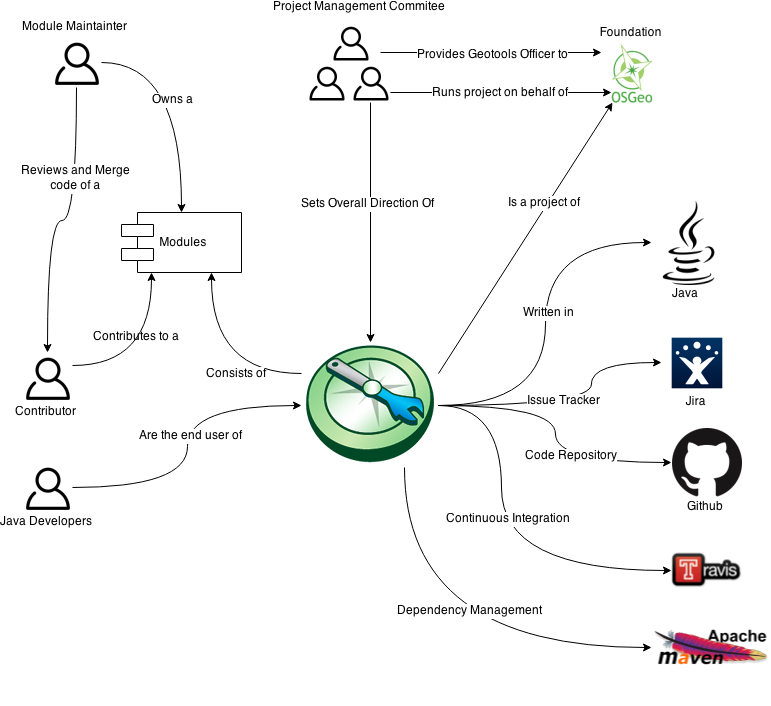
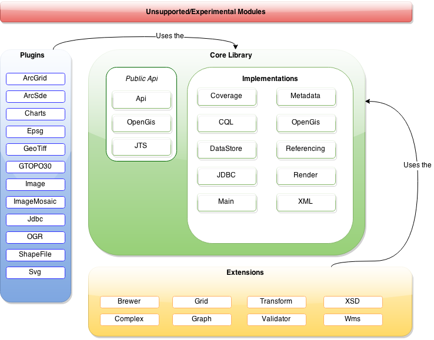
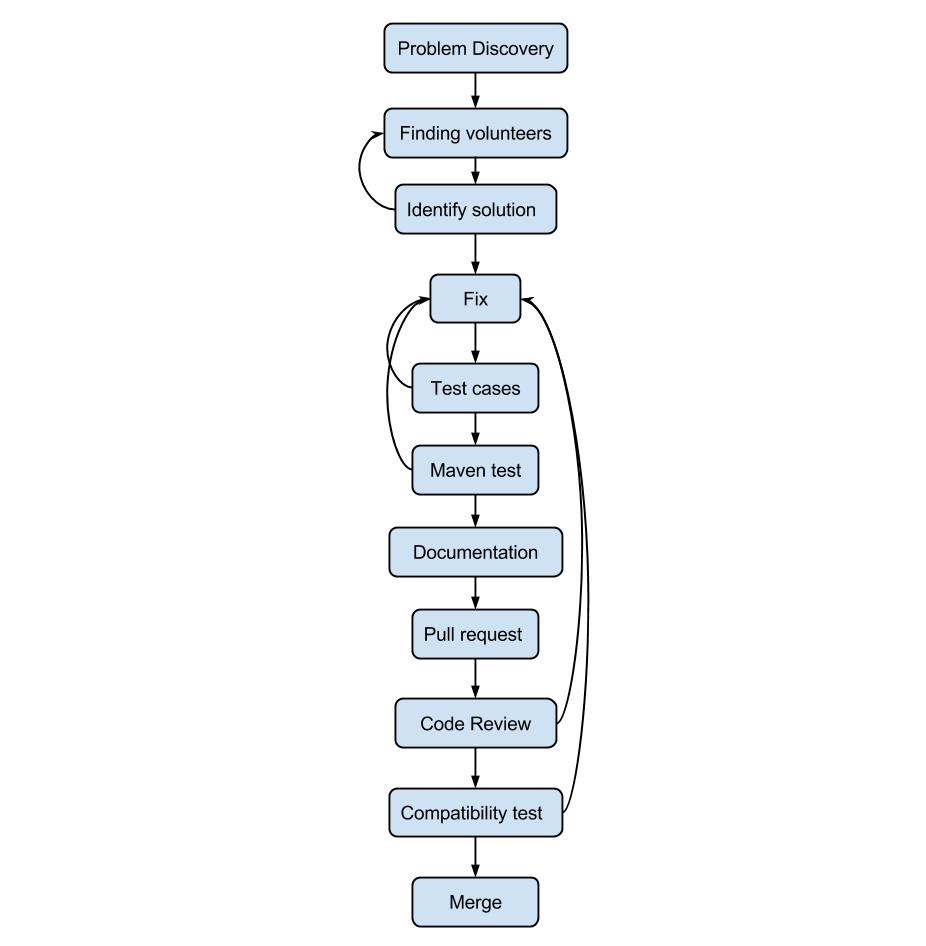
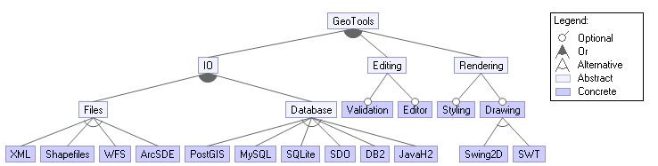
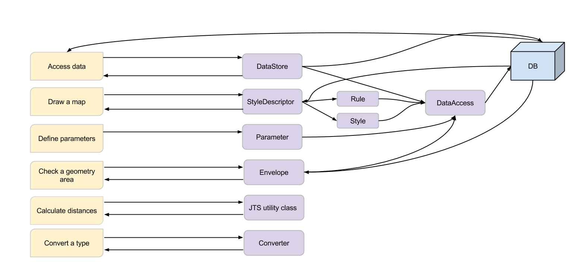
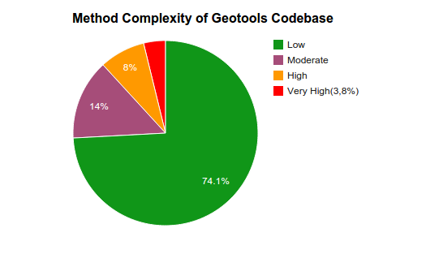
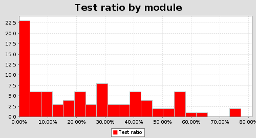
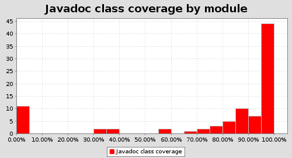

# GeoTools: A map to a successful architecture?

**Sarah Bashirieh, Wouter Groen, Olaf Maas, Willem Vaandrager** 
*Delft University of Technology*

## Abstract

*Java one was released in 1996. In the same year the first version of the Java library GeoTools was released. 19 years later GeoTools is still around and going strong. How has this project survived for almost 20 years, which is an eternity in computer science, in a web based society? How has it developed from an undocumented student project to the widely used well structured open source library it is nowadays? In this chapter we will look at the architecture, the organizations, the people involved and the general development process of the GeoTools library.*

##Table of Contents
1. **[About GeoTools](#about-geotools)**
2. **[Stakeholders](#stakeholders)**
3. **[Development](#development)**
4. **[Development procedure](#development-procedure)**
5. **[Development resources](#development-resources)**
6. **[Variability](#variability)**
7. **[The information viewpoint](#the-information-viewpoint)**
8. **[Metrics](#metrics)**
9. **[Conclusion](#conclusion)**

## About GeoTools
GeoTools is an open source library which provides methods to read, manipulate and render Geospatial data. GeoTools was founded in 1996 when the first java version was just released as a master thesis project at the University Of Leeds. It quickly became a popular library and features were added as needed. After a while there were more features than documentation. The development team consisted of two people and as GeoTools became more popular and more complex it became unmaintainable. In 2002 a complete rewrite from scratch was done and released as GeoTools 2. This version of GeoTools was designed and implemented by a wide variety of developers so it became more maintainable.

GeoTools main goal is to enable developers to work with Geospatial Data. Work in this context means: Import, Export, Edit, Query & Render it. GeoTools is build to be as agnostic as possible in the way the data is delivered to it. The only thing GeoTools needs in order to read a certain file format is a plugin. GeoTools comes with a variety of plugins for different file formats. GeoTools also supports different sources such as Filestorage, Databases and API's.

GeoTools is also able to render the data imported. Rendering is actually one of GeoTools core features. The default renderer uses the Java2D API, however there are 3D or Swing renderers available. If the main features are not enough for your project GeoTools also contains an extensions API in which developers can extend or add even more functionality.

## Stakeholders
The stakeholders are the people who are affected by a system. GeoTools most important stakeholder is the [OSGeo Foundation](http://www.osgeo.org/content/foundation/about.html). OSGeo is the main supplier and provides financial and legal support to multiple libraries in the field of Geospatial software. It is also the entity that owns the rights to the GeoTools code, which makes sure the contributions made will be maintained for public benefit. The main direction of the GeoTools is set by the [Project Management Committee](http://docs.GeoTools.org/latest/developer/roles/committee.html), this committee runs the project on behalf of the OSGeo Foundation. The PMC consists of 7 people who can vote on management decisions. They also provide a GeoTools officer which is in the board of the OSGeo foundation.

GeoTools is a modular project and every supported modules has a so called [Module Maintainer](http://docs.GeoTools.org/latest/developer/roles/maintainer.html), this maintainer is responsible for the quality of a certain module. When a contributor wants to contribute to a certain module, the module maintainer is the person responsible for reviewing and merging the code. When there is a bug in a module, the module maintainer also carries the main responsibility for fixing this bug. The end users of GeoTools are Java Developers who are in need of a library which does the dirty work of processing the Geospatial Data for them.

To show the stakeholders and interactions between the system and the entities in its environment we created the following Context View:

##Development
In this chapter we are going to describe the structure of the environment that supports the software development process in GeoTools. We are going to explain Module Organization which is about code structure, common processing, standardization of design and testing, codeline organization, which is about build and configuration management, and at last we briefly explain the instrumentation.

###Module Organization
The development viewpoint describes the architecture that supports the software development process. Our goal is to obtain a high-level structure of the system which can be used as a starting point for the more detailed design of the system.
In order to make such an architecture, we are focusing on code structure and dependencies of the GeoTools project. First we looked at the modules of the project.

GeoTools consists of multiple main modules which can be separated in many smaller submodules. The first main module is the Core Library. This module can be split up in the following two parts:
- Public API: These modules expose the main public API of the GeoTools to the public which can be used by the user.
- Implementations: These are the core modules of GeoTools, the users probably should not use these modules, these are only used internal.

The Plugin Module is the second main module, in this module the plugins are housed. Plugins are used to learn the system to handle additional data formats. The Extensions module, which is the third module is used for extensions to the system. It adds functionality on top of the core services of GeoTools. Lastly GeoTools comes with Unsupported modules, these modules are experimental and should be used on own risk.

###Common Processing
The common parts of the project are divided into subcategories of the modules. This can be seen in the image above. The colored blocks represent the modules of GeoTools, with each module containing smaller blocks representing what feature they fulfill in the project. This way the parts are isolated into code units that can be used separately and easier to maintain when a problem arises. Logging in GeoTools is done on a per module basis. GeoTools uses the default java.util logger class.

They modules are strictly maintained by their [module maintainers](http://docs.GeoTools.org/latest/developer/roles/maintainer.html) and have a [defined structure](http://docs.GeoTools.org/latest/developer/conventions/module.html) to keep classes, parameters and other parts easy to find for the developer. Every module contains a pom.xml file providing the metadata for maven. The '/src' folder contains the main code and the tests for the module and the '/target' folder contains the build data, docs and logs for maven.

###Standardization of Design
The design rules GeoTools applies is the [Maven Standard Directory Layout](http://maven.apache.org/guides/introduction/introduction-to-the-standard-directory-layout.html). GeoTools uses this layout to keep a clear overview of how their modules are built and this will keep the code maintainable. The project is split up into modules and for each module there is a standard structure that is has to comply to. The [modules](http://docs.GeoTools.org/latest/developer/conventions/module.html) are large and contain multiple categories, so the developers can assign features to the module it belongs to.

For their code they also have set up some rules how the code should look like to keep files maintainable. In order to keep the code clean they have picked rules for what [style](http://docs.GeoTools.org/latest/developer/conventions/code/style.html) should be used, how to name [the classes and methods](http://docs.GeoTools.org/latest/developer/conventions/name.html) and how to [refactor existing methods](http://docs.GeoTools.org/latest/developer/conventions/refactor.html).

###Standardization of Testing
GeoTools asks for test code for code to be accepted. They ask for a minimum of 40% code coverage and want to keep the time to run all the tests below 20 seconds for a module to keep it [fast to build](http://docs.GeoTools.org/latest/developer/conventions/test/test.html). They mostly want the main functionality of a method or class to be tested. So tests should be run on good examples and get the expected value, rather than testing if every possible exception returns the correct handling.

To easily find and store test data they have a few rules for where to store the data. For java test-cases this should be in a testcase directory in your test folder and for maven tests this should go be placed into src/test/resources.
If your tests require [test data](http://docs.GeoTools.org/latest/developer/conventions/test/data.html), there are a couple of things to keep in mind.

For speeding up the writing of tests there is a class called ‘TestData Utility Class’ containing a few helpful method that you can call when writing a test case. Furthermore, when using a file for multiple tests GeoTools has a special folder for storing the files that are used in a lot of tests that can be accessed with this Testdata utility class.

###Codeline Organization
####Directory structure
In 2002 GeoTools decided to make the [directory structure](https://locationtech.org/mhonarc/lists/udig-dev/msg05472.html) not too deep and simple. But in 2006 when Maven 2 standard came out they needed a structural change; in order to make the structure according to maven and also make more room for other programming languages. The [changes in the directory structure](http://jira.codehaus.org/browse/GEOT-982) were the following:

- Java source code was initially in "<module>/src/" directory then it moved to "<module>/src/main/java/" directory.
- Test source code was initially in "test" directory then it moved to "src/test/java" directory.
- Resources were bundled in the "src" directory then they created a directory resources and they moved it to the "<module>/src/main/resources/" directory.
- They moved some unsupported modules in a new directory, called "unsupported".

The most updated directory structure of the GeoTools is as the following:

- Build : This folder contains everything that is needed for a successful build such as build dependencies and build scripts for eclipse and maven.
- Module: The most of the code and many important folders are in this folder. The structure is as described in the Module Organization part. The naming of the directory of the modules is very clear. *mainmodule/submodule*
- Spike: An experimentation environment.
- Docs

####Versions
GeoTools has a development version and one or more stable versions. These stable versions can be active or not active. In active versions developers are still working on improvements. This is also called a SNAPSHOT version. Usually there will be two active snapshots:

- Associated with the most recent formal release.
- The development version snapshot.

Furthermore, formal releases are based on a stable branch so the released version is more stable. GeoTools does iterative development, therefore they have a lot of releases.

####Testing
For every piece of code there will be a test.

- JUnit: Before coding there should be unit testing for each class.
- Online Tests: GeoTools has an extra test environment for developers called Online Tests. Developers can also use external web services and databases for the online tests. Note that these tests are not always mandatory.

###Instrumentation
GeoTools use two code profilers that have [instrumentation capabilities](http://docs.GeoTools.org/latest/developer/conventions/profile.html), these profilers analyze performance and memory of applications.

- **YourKit**

[YourKit](http://www.yourkit.com/) is a CPU and memory profiler for Java applications. GeoTools PMC has been granted 10 licenses, each one can be used by at most one developer. Right now the main developers [claimed most of 10 licenses](http://docs.GeoTools.org/latest/developer/conventions/profile.html).

- **HPJMeter**
[HPJMeter](https://h20392.www2.hp.com/portal/swdepot/displayProductInfo.do?productNumber=HPJMETER) is a Java performance analysis tool which shows:
- Method call counts
- Method execution times
- Method call graph
- Number of allocated objects
- Allocation sites
- Object reference graph
- Lock contention

##Development procedure
This procedure is for the actual development team members. They all signed a development agreement and they are daily active in development.

- **Problem Discovery**: Once a problem or a need for a new feature or enhancement is discovered an issue will be placed on Jira. The issue contains the contact information of the person who initiate the issue, the status of the issue (which is open in this phase), title and description of the issue.
- **Finding volunteers**: As we mentioned in the previous paragraph there will be an issue with a proper description. Other people can read the description of the issue and discuss it. The discussion is about the possible solutions, alternative solutions and also about who can accept the responsibility of the issue. The discussions are take place in the form of the comments under the issue description. After discussions a person who initiate the issue can assign himself or someone else to the issue. This person will be responsible to resolve the issue.
- **Identify solution**: The responsible developer chose a solution for the issue. Sometimes the responsible person can not agree on a solution which is proposed. So the person can unassigns him/herself and there is a need for another volunteer.
- **Fix**: In this step the developing of the solution takes place.
- **Test cases**: The solution should be accompanied with proper test cases which cover the total functionality of the code.
- **Maven test**: Next step is to run a maven test for the solution and the test cases.
- **Documentation**: A proper documentation about the functionality of the code and also the compatibility with the whole system needs to be handed in.
- **Pull request**: The developer initiates a pull request with the issue number.
- **Code review**: After the pull request a member from the core developer team which as we mentioned before are the most active developers and they have the best insight about the system is going to review the code. If the quality of the code is not sufficient the developer needs to modify the code again. Note that core developers review each others code and comment on it.
- **Compatibility test**: After a positive code review the code will be tested with the whole system in order to find out whether the code is compatible with the whole system. Again if this part fails the responsible person needs to modify the code.
- **Merge**: At the end if every step is successfully accomplished one of the core developers merges the code. Note that the core developers do this step by themselves.

**Development procedure diagram**

##Development resources

To build the GeoTools project, multiple resources are needed. The OSGeo foundation owns the GeoTools project and provides legal support. It also funds the project as needed. As the project is open source and developed on Github by a lot of volunteers, funding is not a really import resource, because the project doesn't need an office or people on their payroll.

So the most important resource to GeoTools are skilled people who want to volunteer. This is a really scarce resource, the GeoTools codebase is very large and as a developer who wants to contribute this codebase can sometimes be overwhelming. Furthermore, the codebase sometimes contains quite complex rendering and calculation functions which are not easy to get into. The current developers working at GeoTools are really skilled and dedicated, but in the future it may be a problem to acquire new talent.

Another important resource for GeoTools are the services they use to help develop the library. They allow GeoTools to keep track of what has to be done to progress the project, checking if the code is implemented properly and document the parts that are implemented to help the developers and users of GeoTools. As this report is written the GeoTools Project is facing a problem with one of these services. Codehaus, the hosting provider which provides the hosting for the GeoTools Wiki, JIRA and Travis build server, is shutting down. This means all these services have to migrate to other services. Luckily the OSGeo foundation has donated money to set up a new server with all the necessary software.

##Variability

**Features**
GeoTools is build to be as agnostic as possible in the way the data is delivered to it. The only thing GeoTools needs in order to read a certain file format is a plugin. GeoTools comes with a variety of plugins for different file formats. GeoTools also supports different sources such as Filestorage, Databases and API's.

1. Import geospatial data in multiple file formats.
1. Import geospatial data from multiple sources (Files, Databases, API's)
1. Query the imported geospatial data.
1. Let Developers write their own plugin for new file formats.
1. Transforming the data
1. Add data validation
1. Export data to XML

**Rendering**

Rendering is one of GeoTools core features. The default renderer uses the Java2D api, however there are 3D or SWING renderers available.

1. Rendering the data on a map
1. Setting the style of the map
1. Creating a reusable map "Theme".
1. Rendering using SWT or Swing.

**Misc**

GeoTools is build based on modules, if a developer wants to change default behaviour he is able to extend GeoTools using its Extensions API. GeoTools is also able to enhance data with extra information the original format did not have, these are called features.

1. Expose an Extensions API so Developers can change the library.
1. Adding Simple or Complex features to geospatial data and query it.

Due to the way the project has been set up, all the implemented features seem to be able to work together. This module architecture also means that not much useless code is included in your projects, since every module is in a separate JAR file and only the modules you would use are therefore included.

The following image shows the variability view to illustrate the possible ways in which the developer can include the GeoTools library.

##The information viewpoint
In this data flow diagram we show the flow of data from external entities into the system, furthermore we show how the data moves from one process to another process.

The purple squares represent processes. Each process take data as input, do something to it, and output it.
The external entity of this diagram is the user. For a more clear diagram we divided the external entity (user) to different tasks which the user wants to perform. So each yellow square is a task which a user performs. Furthermore, these squares are actually the sources or destinations of data. The arrows represent the data flows and directions. We described the flow of the data with helping of performing different tasks by users.

####Access data
When a user wants to access some data the dataStore and/or DataAccess will be used.
There is a difference between these two processes. dataStore is used to get a high level and simple information such as name and description. To actually retrieve the data, the DataAccess should be used. Unlike dataStore, DataAccess allows users to retrieve the desired data completely.
The data types which return to the destination point is URI, string, vector or integer.
####Draw a map
When a user wants to draw a map with some specifications StyleDescriptor will be used. StyleDescriptor is simply aimed to define how a web map server can draw an entire map. Furthermore, through Rule and Style the user can draw a map which is near his/hers expectations. The style of the map can be defined in detail like colors and lines with help of the Style. Furthermore, with Rule the user can control the data which will be retrieved. For example if the user wants to draw a very high detailed level map or he can discard the detailed data using Rule.

####Define parameters
Accessing the data with some predefined parameters leads to more suited result. A user can define some parameters before accessing the data and that is possible through Parameter. For example the user can define the maximum number of objects in a query.

####Check geometry area
A user wants to check whether a geometry is in a specific area. This is possible by using Envelope. The user should give the boundaries of the geometry to Envelope. Next the query will be executed and the result which is a boolean will be given to the external entity.

####Calculate distances
When a user wants to calculate the real-world distance between two points, the position of these points in CoordinateReferenceSystem type should be handed to JTS utility class. Furthermore, JTS utility class calculates the distance and the result which most of the time is a double, will be shown to the user.

####Convert a type
A user may want to convert a value of one type to a value of another type. The most common case of this is to parse a string into another type of value. By giving the source type and target type the Converter can convert the desired value to a desired type.

## Metrics

GeoTools is an old open source project which started in 1996. During its lifetime the development of GeoTools had a number of different Goals in the development process. At the start the number one priority was adding functionality which eventually lead to a full rewrite at the start of 2000's due to the unmaintainable code. The last years the main focus of the development was set on the maintainability and stability of the GeoTools system instead of just adding new features. We decide to use the [GQM](http://en.wikipedia.org/wiki/GQM) method to do some metrics on the GeoTools Codebase. The first thing we did when using this method was formulating the following goal.

After formulating the goal we decided to formulate questions about this goal. For every question we formulated two metrics which could be used to an answer that question. 

*Question 1*: How complex is the code?

* Cyclomatic Complexity of the methods

    * __Entity__: Methods in the GeoTools code base.
    * __Attribute__: Cyclomatic Complexity.
    * __Mapping__: Scores calculated by CodeMetrics divided into 4 risk categories. 
    
* Nr of Cyclic Dependencies

    * __Entity__: Dependencies in the GeoTools Codebase
    * __Attribute__: Cyclic Dependencies
    * __Mapping__: Nr of Cyclic dependencies per module

*Question 2*: How well documented is the code base?

* Number of test source lines of code (sloc) compared to the total number of sloc.

    * __Entity__: GeoTools Code Base
    * __Attribute__: Ratio of test sloc
    * __Mapping__: (Number of the test sloc/Number of total sloc)
    
* Javadoc class coverage per module

    * __Entity__: Classes
    * __Attribute__: % of class covered by Javadoc per module
    * __Mapping__: % of field & methods covered by Javadoc per module

After defining all metrics it was time to measure these metrics. To calculate most of the results we used the [Metrics Reloaded](https://github.com/BasLeijdekkers/MetricsReloaded) tool for IntelliJ. The results of this tool were exported to a CSV file which was loaded into a spreadsheet program to generate the graphs. We only looked at the supported code to generate these metrics, the code in the unsupported directory was ignored. We only included test methods in the test results in the Test Ratio metric. It should be mentioned that we were not able to measure the number of Cyclic dependencies, the tool we used crashed multiple times during this measurement due to the size of GeoTools.

__Method Complexity__

Metrics Reloaded generated a CSV file which contained all methods in the GeoTools code base (~66000), the number of source lines of code these methods have and the complexity of these methods. We used the following measurements as described in this [paper](http://portal.ou.nl/documents/114964/2986739/T66311_02.pdf) mentioned by Eric Brouwer. These categories are:
 

|Complexity|Category|
|---|---|
|1-5|Low|
|6-10|Middle|
|11-25|High|
|>25|Very High|

We looked at the number of lines of code which are in these categories. We obtained the following chart. Over 75% of the source code has a low complexity. 14% has a moderate complexity. 8% has a high complexity and 3.8% a Very High complexity. Most of the methods in the Very High complexity category are complex due to a big switch case statement in the method.

__Test Ratio__

For every module we let Metrics Reloaded calculate the ratio of the number of lines which were test code compared to the total number of lines. 23 modules don't have any test code at all. For all other modules it varies widely. It should be mentioned that 10 modules don't contain any Java code at all. The results can be seen in the following diagram:

__Javadoc Class Coverage__

We used the Metrics Reloaded plugin to calculate the Class Coverage per module. We let Metrics Reloaded generate the following histogram of the calculated data. Approximately 10 modules don't have any javadoc whatsoever, most of these modules are main modules or modules which solely consists of data. Most modules has a JavaDoc coverage of more than 55%.

##Conclusion
Is the GeoTools a map to a successful architecture? After studying the GeoTools codebase for several weeks we can conclude that GeoTools is still going strong. 19 years since its birth it has grown into a serious and well maintained software project. The modular structure makes sure the project is easy to extend for developers that wish to use it. Furthermore, it makes it easier for developer to cherry pick the functionality they desire. This structure also makes sure there is one developer responsible for all changes done to this module which, in combination with test coverage guidelines, make sure the quality of the module is maintained.

Due to the effort done by the development team in recent years the codebase has become well maintainable. This reflects in the statistics obtained. It is a shame that Codehaus, the platform used for Testing, Issue Tracking and Documentation is closing down and GeoTools must make a transition to other service. Luckily the GeoTools project has a great partner in the OSGeo foundation who provided a new home for these services. The biggest fear the GeoTools project should have in the near future is the number of qualified new programmers who want to contribute to the GeoTools project. GeoTools is a big project and it can be quite hard to start working on the code.
